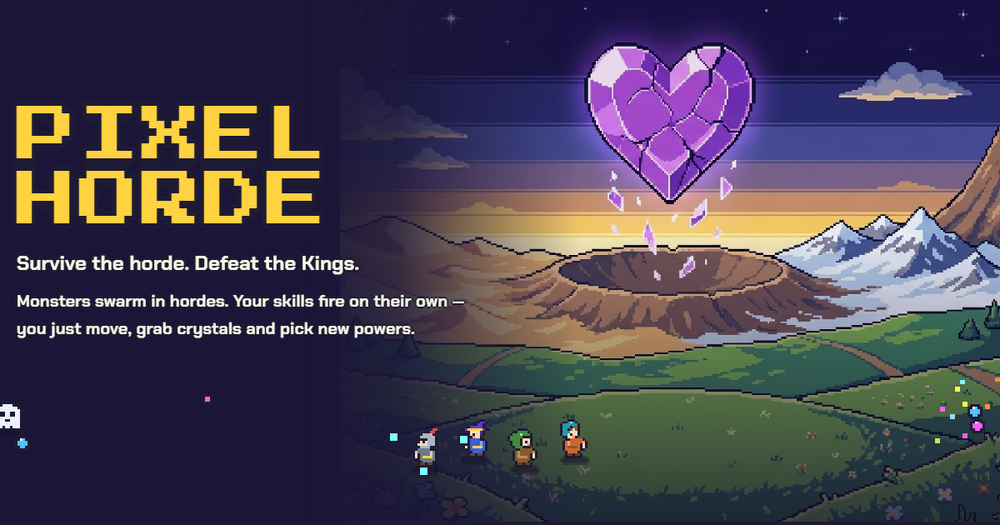
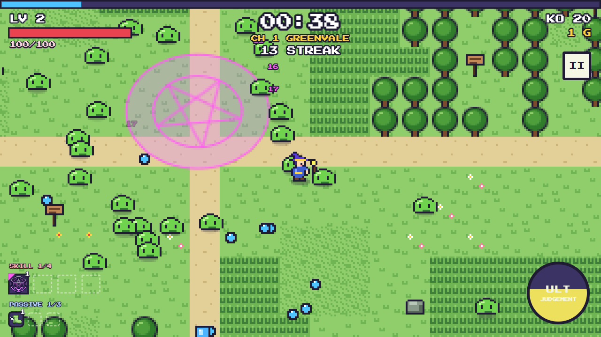
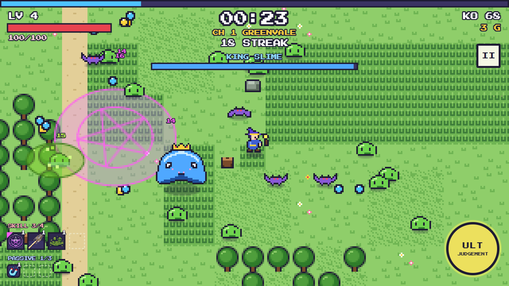
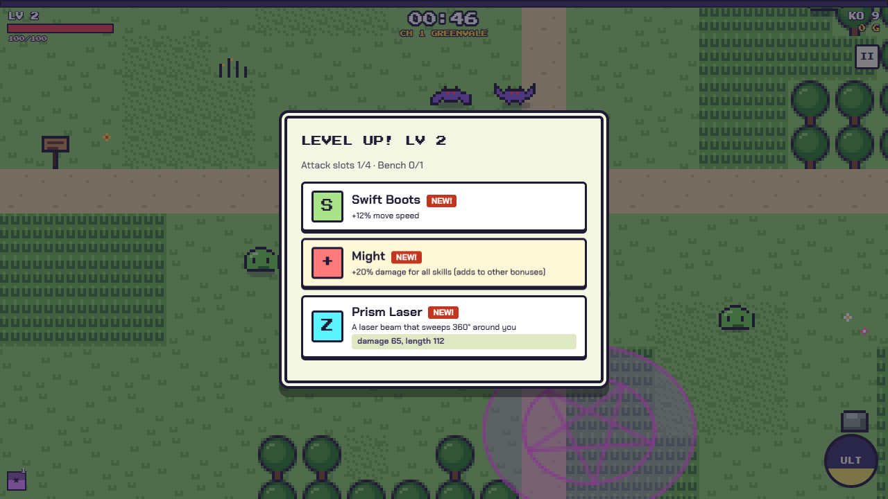
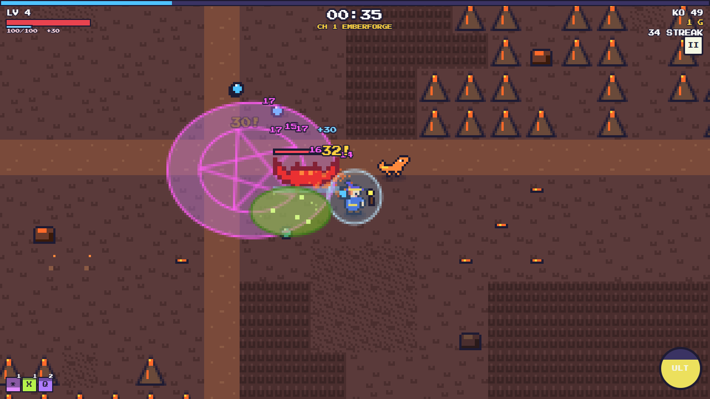
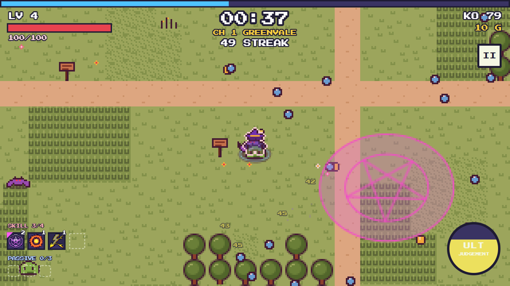
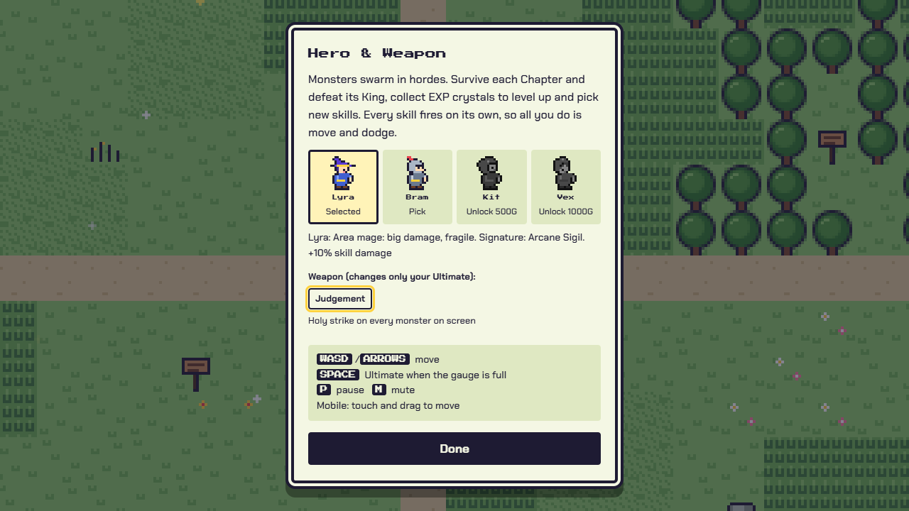

<p align="center">
  
</p>

<p align="center">
  <b>A free pixel-art horde-survival game for the web.</b><br>
  Skills fire on their own — you move, grab crystals and pick new powers.<br><br>
  <a href="https://pixel-horde.pages.dev/play/"><b>▶ Play now</b></a> ·
  <a href="https://pixel-horde.pages.dev/">Website</a> ·
  <a href="https://pixel-horde.pages.dev/guide.html">How to play</a> ·
  <a href="https://pixel-horde.pages.dev/skills.html">Skills &amp; Combos</a> ·
  <a href="https://pixel-horde.pages.dev/updates.html">Updates</a> ·
  <a href="README.th.md">ภาษาไทย</a>
</p>

---

## The game

The **Heart of Lumora** has shattered. Its shards drove every Realm's King mad and pushed the monsters into hordes.
Pick one of four Heroes, walk into the swarm and bring the shards home.

<table>
  <tr>
    <td width="50%"><br><sub>Skills fire on their own; you move and dodge.</sub></td>
    <td width="50%"><br><sub>A King arrives at 55% of the Stage timer.</sub></td>
  </tr>
  <tr>
    <td><br><sub>Level up: pick 1 of 3 — a new skill, an upgrade or a passive.</sub></td>
    <td><br><sub>11 Realms, each with its own monsters, traits and King.</sub></td>
  </tr>
  <tr>
    <td><br><sub>Blood Moon: far more monsters, double Gold and a bonus chest.</sub></td>
    <td><br><sub>Pick your Hero and the Weapon that shapes your Ultimate.</sub></td>
  </tr>
</table>

### How to play in 30 seconds

| | |
|---|---|
| **Move** | `WASD` / arrow keys, or touch and drag on a phone. There is no attack button. |
| **Skills** | Everything fires by itself. Collect blue EXP crystals to level up and pick 1 of 3 cards. |
| **Ultimate** | `SPACE` (or the ULT button) when the gauge is full. |
| **Goal** | 8 Chapters per Run: Greenvale → pick 1 of 2 Realms six times → Heart Crater → Umbra. Clear a Chapter by defeating its King before it escapes. |
| **Keep** | Only Gold survives a Run — spend it on permanent upgrades and new Heroes. |

The full illustrated guide, with things you can click and try, lives on the website:
[How to play](https://pixel-horde.pages.dev/guide.html) ·
[Skill table &amp; Combo Lab](https://pixel-horde.pages.dev/skills.html) ·
[Heroes, Realms &amp; Bestiary](https://pixel-horde.pages.dev/world.html).

### What is inside

- **4 Heroes** — Lyra (area mage), Bram (shield knight), Kit (fast ranger), Vex (combo alchemist). Each has a Signature Skill and can **Awaken** into a new form with three new Awakened skills (with the current balance your Links stay and a 5th attack slot opens).
- **28 skills, 6 passives, 16 Evolutions** — max a skill and own its paired passive to evolve it. The Bench keeps spare skills and passives for later.
- **7 element Combos** — freeze then smash (*Shatter*), shock then burn (*Overload*), gather then sweep (*Grinder*)…
- **10 Kings + Umbra** — telegraphed moves, an ultimate below half HP, and far too much to say.
- **Special events** — Blood Moon nights, three Guardian dragons to tame (and fuse), a Shadow Rival wearing your face, double-King Stages.
- **11 Weapons**, each with its own Ultimate (Judgement, Solar Flare, Thunderstorm…), a permanent Shop, achievements, Titles and seasonal leaderboards.
- One difficulty for everyone (every Run is ranked); beating Umbra unlocks **Heart Crack** tiers 1–3 for a harder Run. A camera-distance setting and an in-game **Feedback** button.
- **Co-op for up to 4** over one invite link, and full **offline** solo play.
- **Thai / English** everywhere. Every change is listed on the website's [Updates](https://pixel-horde.pages.dev/updates.html) page, and the title screen shows the newest one.


---

## For developers

A typed rebuild of the original single-file game (`pixel-horde.html`): Vite + TypeScript, no framework, npm workspaces.

```
apps/game/       browser client (fixed-step 60 Hz loop, Canvas 2D, DOM UI, audio, co-op, backend adapters)
apps/site/       official website (this README's pictures; reads game data, sprites and text straight from the code)
apps/admin/      Admin Console (Preact) — Balance Config, feature flags, Tuning Lab
packages/sim/    headless deterministic simulation (seeded RNG, fixed math; no DOM / network / Math.random)
packages/config/ Balance Config schema (defaults, ranges, descriptions) and feature flags
packages/i18n/   th.json / en.json + t()
packages/coop/   co-op room relay rules, shared by the room worker and the in-memory test hub
workers/room/    Cloudflare Worker + Durable Object co-op room
workers/keepalive/ daily ping so the Supabase Free project is never paused
supabase/        migrations, RLS, RPCs, edge functions
scripts/         Pages assembly, screenshots, playtest bot (balance passes), icon atlas
tests/           Vitest (headless sim, golden replay, DB) + Playwright (cross-browser determinism)
```

```bash
npm install
npm run dev          # game  → http://localhost:5173
npm run dev:site     # site  → http://localhost:5180 (its PLAY buttons open the game dev server)
npm run check        # lint + typecheck + tests + builds
npm run build:pages  # site at /, game at /play/  → dist/pages (what Cloudflare Pages serves)
npm run test:browser # Playwright: built game + Admin in Chromium / Firefox / WebKit
npm run playtest -- heroes 16   # balance bot, see scripts/playtest/README.md
```

- Game URL flags: `?offline` (no backend; the last cached Balance Config, else the built-in defaults) and
  `?debug=god|bloodmoon|dragon|frostdragon|stormdragon|rival|realm:<id>` (comma separated) to force events;
  press **I** in a Run for the balance meter (DPS, TTK, multipliers, Director, mob count).
- Balance changes never touch the built-in defaults: passes live in `packages/config/src/balance-pass.ts` and are published
  as new Balance Config versions from the Admin Console (Admin → Balance), together with a report and patch notes.

- The website pulls skills, stats, combos, Realms, sprites and Thai/English text from `packages/*` and `apps/game`, so it follows the game after every build. Only the website's own sentences live in `apps/site/src/text.ts`.
- Screenshots in `apps/site/public/shots` are real captures: build the game, run `npx vite preview apps/game --port 4190`, then `npm run shots` (offline, god mode, scripted bot).
- Deploying, the database and the Admin Console: [docs/deploy.md](docs/deploy.md) · design: [blueprint](docs/blueprint/pixel-horde-blueprint.md) · words we use: [CONTEXT.md](CONTEXT.md) · decisions: [docs/adr](docs/adr) · daily error/feedback triage: [docs/agents/triage-routine.md](docs/agents/triage-routine.md) · sprites and skill icons: [docs/sprite-lab.md](docs/sprite-lab.md).
